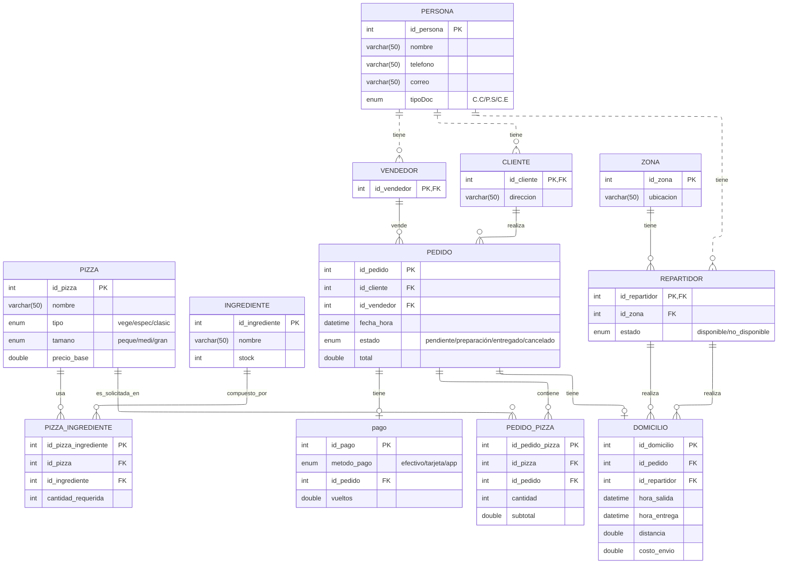

<h1 align=center>Base de Datos (DB) Pizzería don Piccolo</h1>
 

 <h6 align=center>Proyecto MYSQL: (Sharick Giovanna Pinto Rodriguez)</h6>

 <div align="center">


</div>

---

# Tabla de Contenido
<h6 align=center> 1. Introducción </h6>

<h6 align=center> 2. Descripción del Proyecto </h6>

<h6 align=center> 3. Estructura de la Base de Datos </h6>

<h6 align=center> 3.1. Modelo Logico </h6>

<h6 align=center> 4. Construccion del modelo fisico </h6>

<h6 align=center> 5. Consultas <h6>

## 1. Introducción

Este proyecto implementa una base de datos relacional en MySQL para la gestión de una pizzería.  
La base de datos centraliza información de personas (clientes, vendedores, repartidores), zonas de reparto, pizzas, ingredientes, pedidos, pagos y domicilios, con datos de prueba diseñados para practicar:

- Consultas SQL (SELECT, JOIN, GROUP BY, etc.).
- Funciones y agregaciones.
- Triggers y vistas (sobre la misma estructura).

## 2. Descripción del proyecto

Este proyecto tiene como propósito estructurar el diseño de una base de datos para un sistema de gestión de una pizzería. La propuesta incluye la construcción del modelo conceptual, lógico y físico, junto con la definición de validaciones, restricciones e índices que aseguren un almacenamiento de información consistente, eficiente y seguro.

Con esta arquitectura se pretende optimizar el manejo integral de los datos operativos del negocio —clientes, vendedores, repartidores, pizzas, ingredientes, pedidos, pagos y domicilios— permitiendo una organización clara, consultas rápidas y control preciso de las actividades diarias. En conjunto, el sistema se plantea como una solución escalable y robusta, capaz de adaptarse al crecimiento de la información y a las necesidades analíticas propias de la operación de una pizzería.

## 3. Estructura de la Base de Datos

La entidad persona sirve como base para los roles de cliente, vendedor y repartidor, evitando duplicación de información y permitiendo un control claro de cada actor. Las tablas pizza, ingrediente y pizza_ingrediente definen el catálogo de productos y sus recetas, mientras que pedido, pedido_pizza, pago y domicilio modelan el proceso completo de venta, detalle del pedido, transacción y entrega. Esta estructura garantiza integridad, claridad relacional y soporte adecuado para consultas y análisis operativos.

## 3.1 Modelo Logico 



## 4. Construccion del modelo fisico
Tras definir el modelo lógico y garantizar que cumpliera con la normalización hasta la Tercera Forma Normal, el siguiente paso consistió en llevar el diseño al modelo físico mediante sentencias SQL. En esta fase se implementaron todas las tablas del sistema de la pizzería, junto con sus claves primarias, claves foráneas y restricciones necesarias para asegurar integridad referencial, coherencia en los datos y un funcionamiento adecuado del sistema.

<h4> Descripción </h4>

El modelo físico se construyó directamente en MySQL, creando cada tabla de acuerdo con su estructura definida en el modelo lógico e incorporando relaciones entre entidades mediante la declaración de llaves foráneas. Estas relaciones permiten controlar el flujo real del negocio: clientes asociados a personas, pedidos vinculados a vendedores, domicilios asignados a repartidores, recetas de pizzas formadas por ingredientes, entre otros.

<h6> Codigo</h6>
**[NOTA]** : Todo el código de creación de tablas y carga de datos se encuentra unificado en el script SQL del proyecto (por ejemplo, `database.sql`), el cual puede ejecutarse completo para generar automáticamente la base de datos y poblarla con datos de ejemplo.

<br>

`1.` Desde la terminal de *Linux*, escribir el comando:

```
mysql -u tu_usuario -p
```
`2.` Una vez dentro, se deberá ejecutar el comando **CREATE DATABASE pizzeria**; ejecutarlo en un entorno **Shell**):

```
CREATE DATABASE pizzeria;
```
`3.` Una vez creada la base de datos, vamos a entrar en ella usando **use pizzeria;** dentro de (**Shell**):

```
use pizzeria;
```

`4.` Acceder al archivo `consultas.sql` y ejecutar los bloques de comando indicados allí en orden (copiar y pegar bloque por bloque, del archivo a la **Shell**).
<br>

## 5. Consultas 
En esta sección se presentan consultas clave construidas sobre la base de datos pizzeria, alineadas con los requerimientos funcionales del sistema. Se incluye la consulta, el resultado esperado y una explicación detallada del proceso lógico detrás de cada operación.

---

 1. Clientes con pedidos entre dos fechas (BETWEEN)

```
DELIMITER //
CREATE PROCEDURE pedidos_cliente_xmes(IN fecha_inicio DATETIME, IN fecha_final DATETIME)
BEGIN
    SELECT per.nombre as nombre_persona, ped.fecha_hora as fecha_pedido, ped.id as id_pedido  
    FROM pedido ped 
    LEFT JOIN persona per ON ped.id_cliente = per.id 
    WHERE ped.fecha_hora BETWEEN fecha_inicio AND fecha_final;
END; //
DELIMITER ;

```
**Como funciona?**

`BETWEEN` filtra los pedidos realizados dentro del rango.

`LEFT JOIN` persona permite mostrar el nombre del cliente.

**Llamado**
```
CALL pedidos_cliente_xmes('2025-01-01 00:00:00', '2025-12-31 23:59:59');
```

---


2. Pizzas más vendidas (GROUP BY + COUNT)
```
DELIMITER // 
CREATE PROCEDURE pizzas_mas_vendidas()
BEGIN
    SELECT pi.id,
           pi.nombre,
           COUNT(*) AS pizzas_mas_vendidas
    FROM pizza AS pi 
    JOIN pedido_pizza AS pe ON pi.id = pe.id_pizza
    GROUP BY pi.nombre
    ORDER BY pizzas_mas_vendidas DESC;
END; //
DELIMITER ;

```
**Como funciona?**
Cuenta cuántas veces aparece cada pizza en `pedido_pizza`.

Ordena de mayor a menor para obtener las más vendidas.

**Llamado**
```
CALL pizzas_mas_vendidas();

```

---

3. Pedidos por repartidor (JOIN)

```
DELIMITER //
CREATE PROCEDURE pedidos_x_repartidor()
BEGIN
    SELECT p.id AS id_repartidor,
           p.nombre,
           do.id AS id_domicilio,
           COUNT(*) AS cantidad_pedidos
    FROM persona AS p 
    JOIN domicilio AS do ON p.id = do.id_repartidor   
    GROUP BY do.id_repartidor;
END; //
DELIMITER ;


```
**Como funciona?**
`JOIN domicilio` relaciona repartidores con los pedidos que entregaron.

`COUNT(*)` contabiliza cuántos domicilios realizó cada repartidor.

`Llamado`
```
CALL pedidos_x_repartidor();

```

---
**DENTRO DEL ARCHIVO CONSULTAS.sql estan las demas consultas**
