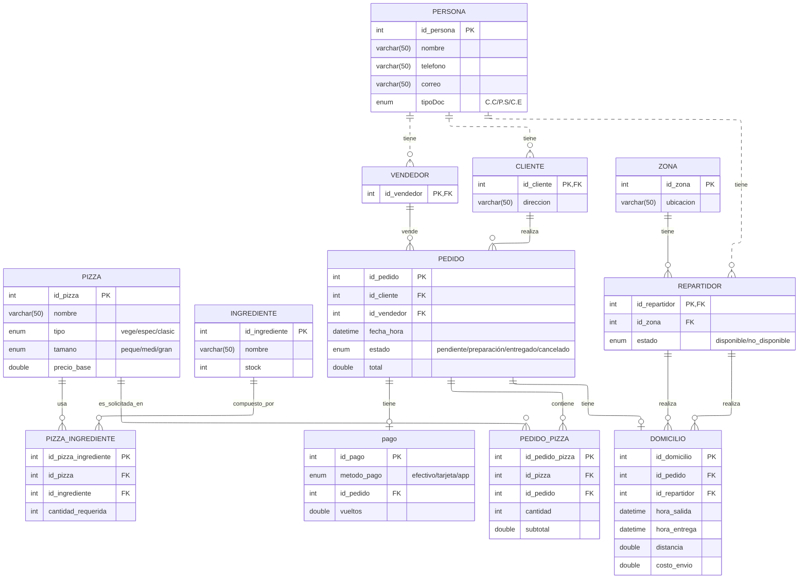

<h1 align=center>Base de Datos (DB) Pizzería don Piccolo</h1>
 

 <h6 align=center>Proyecto MYSQL: (Sharick Giovanna Pinto Rodriguez)</h6>

 

---

# Tabla de Contenido
<h6 align=center> 1. Introducción </h6>

<h6 align=center> 2. Descripción del Proyecto </h6>

<h6 align=center> 3. Estructura de la Base de Datos </h6>

<h6 align=center> 3.1. Modelo Logico </h6>

<h6 align=center> 4. Ejemplos de Consultas SQL  </h6>

<h6 align=center> 5. Instrucciones para Ejecutar el Script <h6>

## 1. Introducción

Este proyecto implementa una base de datos relacional en MySQL para la gestión de una pizzería.  
La base de datos centraliza información de personas (clientes, vendedores, repartidores), zonas de reparto, pizzas, ingredientes, pedidos, pagos y domicilios, con datos de prueba diseñados para practicar:

- Consultas SQL (SELECT, JOIN, GROUP BY, etc.).
- Funciones y agregaciones.
- Triggers y vistas (sobre la misma estructura).

## 2. Descripción del proyecto

Este proyecto tiene como propósito estructurar el diseño de una base de datos para un sistema de gestión de una pizzería. La propuesta incluye la construcción del modelo conceptual, lógico y físico, junto con la definición de validaciones, restricciones e índices que aseguren un almacenamiento de información consistente, eficiente y seguro.

Con esta arquitectura se pretende optimizar el manejo integral de los datos operativos del negocio —clientes, vendedores, repartidores, pizzas, ingredientes, pedidos, pagos y domicilios— permitiendo una organización clara, consultas rápidas y control preciso de las actividades diarias. En conjunto, el sistema se plantea como una solución escalable y robusta, capaz de adaptarse al crecimiento de la información y a las necesidades analíticas propias de la operación de una pizzería.

## 3. Estructura de la Base de Datos

La entidad persona sirve como base para los roles de cliente, vendedor y repartidor, evitando duplicación de información y permitiendo un control claro de cada actor. Las tablas pizza, ingrediente y pizza_ingrediente definen el catálogo de productos y sus recetas, mientras que pedido, pedido_pizza, pago y domicilio modelan el proceso completo de venta, detalle del pedido, transacción y entrega. Esta estructura garantiza integridad, claridad relacional y soporte adecuado para consultas y análisis operativos.

## 3.1 Modelo Logico 

## 4. Ejemplos de Consultas SQL

